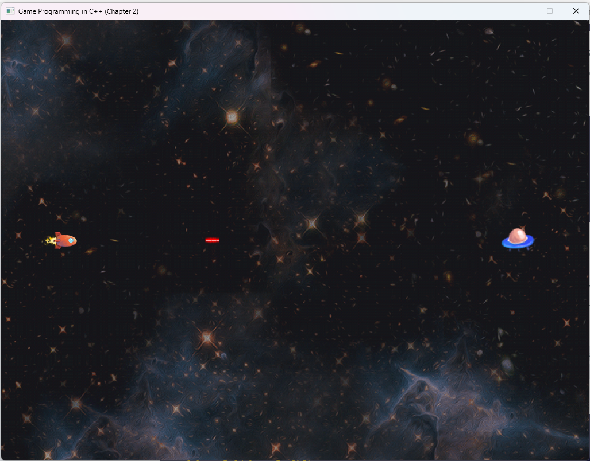

# Space SideScroller

Utilizing the book *Game Programming in C++* by Sanjay Madhav. this is Project 2. I will be incorporating the excercises from the end of the chapter into the game and where applicable adding in my own artisic style. 

##Book Features:
Ability to add multiple "Actors" on the screen.

##Personal Features:
The assets provided had a "laser" sprite. I decided to see if I was able to implement it into the game. It worked! I then added code to make the enemy disappear. My next goal is to create an explosion sprite to give better effects and add it to the game. 

Notice: Unless explicitly expressed, all code is either typed out from the books Github [gameprogcpp](https://github.com/gameprogcpp/code) or pasted in i.e., the Math.h file.

This project uses SDL, Simple Directmedia Layer. Get it here, [SDL](https://github.com/libsdl-org/SDL/releases "Simple Directmedia Layer (SDL) is a framework for creating cross-platform games and applications.")
